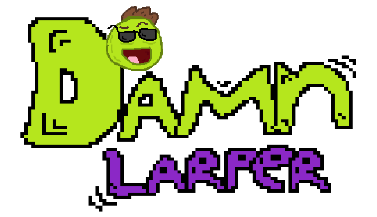

<p align="center">
  
</p>

# Damn Larper

:zap: ¤ Damn Larper is a multipurpose bot with many commands and features. It is basically a text-based game right in your server! This bot has a verification system, which is not allowing the unverified to send messages until they verify themselves. Besides verification, there are also moderation commands such as ban and kick commands. 

In case you're searching for a fun bot, there are categories of commands for economy, custom text commands, miscellaneous commands, levelling system, bump system in development, list system with which you can make your own list and for example write down your chores on them. 

And it's not over yet, you can basically take care of your virtual pet! You can get one at a petshop (it helps you gain sweet bonuses on economy commands!). There's also roleplaying, where you can buy items, craft items, go mining, hunting, fishing and chopping wood - in basic terms, get resources and be a boss (there are command cooldowns though, get premium to avoid them!). 

You can also unlock achievements and get spectacular rewards once you complete them! Regarding to server security, there is a anti-raid and security system which is customizeable! There is also social media-like system where you can post messages and view them on a global feed. More features are waiting you once you add Damn Larp://github.com/maddinat0r/samp-discord-connector)...
5. Compile your script with `pawncc`.
6. Run your script with your open.mp/SA:MP server.

### Sublime Text
If you are using ST3, use `pawn.sublime-build` to run the compiler:
```json
{
	"cmd": [
		"pawncc.exe",
		"-i includes",
		"$file"
	],
	"path": "Location in which pawncc.exe is located."
}
```

### Code dependencies

Main thing you need to run this is a [Discord Connector plugin](https://github.com/maddinat0r/samp-discord-connector/releases) for the SA:MP and open.mp server.

Code also requires `sscanf` plugin in order to run. You can get it [here](https://github.com/Y-Less/sscanf/releases). Besides `sscanf`, code also has support for `crashdetect` plugin you can get [here](https://github.com/Zeex/samp-plugin-crashdetect/releases).

## Executing the code

The code supports both **SA:MP** and **open.mp** servers.

### SA:MP server
Go to the [Official SA:MP download site](https://www.sa-mp.com/download.php) and download the compressed archive with server files. Extract the files and modify your server configuration.

`server.cfg`:
```bat
lanmode 0
rcon_password 123
maxplayers 50
port 7777
hostname SA-MP 0.3 Server
gamemode0 ../discord_entry/d_botscript 1
announce 0
chatlogging 0
weburl www.sa-mp.com
onfoot_rate 40
incar_rate 40
weapon_rate 40
stream_distance 300.0
stream_rate 1000
maxnpc 0
logtimeformat [%H:%M:%S]
language English
discord_bot_token MYBOTTOKEN
```

You should replace `MYBOTTOKEN` with your application bot token. After you've saved your configuration, you can proceed to running the server by executing the SA:MP server.

### open.mp server
Same process - go to [open.mp download repo](https://github.com/openmultiplayer/open.mp/releases) and download the compressed archive that suits your device's operating system. Extract the files and modify your server configuration.

Default `config.json` should look like this:
```json
{
    "announce": true,
    "artwork": {
        "cdn": "",
        "enable": true,
        "models_path": "models"
    },
    "chat_input_filter": true,
    "enable_query": true,
    "game": {
        "allow_interior_weapons": true,
        "chat_radius": 200.0,
        "death_drop_amount": 0,
        "gravity": 0.008,
        "group_player_objects": false,
        "lag_compensation_mode": 1,
        "map": "",
        "mode": "",
        "nametag_draw_radius": 70.0,
        "player_marker_draw_radius": 250.0,
        "player_marker_mode": 1,
        "time": 12,
        "use_all_animations": false,
        "use_chat_radius": false,
        "use_entry_exit_markers": true,
        "use_instagib": false,
        "use_manual_engine_and_lights": false,
        "use_nametag_los": true,
        "use_nametags": true,
        "use_player_marker_draw_radius": false,
        "use_player_ped_anims": false,
        "use_stunt_bonuses": true,
        "use_vehicle_friendly_fire": false,
        "use_zone_names": false,
        "vehicle_respawn_time": 10000,
        "weather": 10
    },
    "language": "",
    "logging": {
        "enable": true,
        "log_chat": true,
        "log_cookies": false,
        "log_deaths": true,
        "log_queries": false,
        "log_sqlite": false,
        "log_sqlite_queries": false,
        "timestamp_format": "[%Y-%m-%dT%H:%M:%S%z]",
        "use_prefix": true,
        "use_timestamp": true
    },
    "max_bots": 0,
    "max_players": 50,
    "name": "open.mp server",
    "network": {
        "acks_limit": 3000,
        "aiming_sync_rate": 30,
        "allow_037_clients": true,
        "bind": "",
        "cookie_reseed_time": 300000,
        "in_vehicle_sync_rate": 30,
        "limits_ban_time": 60000,
        "message_hole_limit": 3000,
        "messages_limit": 500,
        "minimum_connection_time": 0,
        "mtu": 576,
        "multiplier": 10,
        "on_foot_sync_rate": 30,
        "player_marker_sync_rate": 2500,
        "player_timeout": 10000,
        "port": 7777,
        "public_addr": "",
        "stream_radius": 200.0,
        "stream_rate": 1000,
        "time_sync_rate": 30000,
        "use_lan_mode": false
    },
    "password": "",
    "pawn": {
        "legacy_plugins": [],
        "main_scripts": [
            "test 1"
        ],
        "side_scripts": []
    },
    "rcon": {
        "allow_teleport": false,
        "enable": false,
        "password": "changeme"
    },
    "sleep": 5.0,
    "use_dyn_ticks": true,
    "website": "open.mp"
}
```

You should add this part to the `.json` file and save it:

```json
"discord": {
	"bot_token": "MYBOTTOKEN",
	"intents": 131071
}
```

Also, modify the RCON password from `changeme` to something you prefer. You also need to change the `main_script` path.

`...`
```json
    "pawn": {
        "legacy_plugins": [],
        "main_scripts": [
            "../discord_entry/d_botscript 1"
        ],
        "side_scripts": []
    },
```
`...`

After that - you can proceed to running your **open.mp** server.

## Source code structure
| Directory      | Description                                                                                |
| -------------------- | ------------------------------------------------------------------------------------------ |
| `DamnLarper.Entry/` | Basically an entry point. |
| `Discord.API/` | Contains back-end natives and functions. |
| `DamnLarper.Modules/` | Once upon a time, this bot code was just a single `*.pwn` file, so I decided to split it into modules. |
| `DamnLarper.Components/` | Bunch of deprecated functions, commands and systems whose were too big to be removed. |

## Privacy Policy

All of your information is safe!

Please note that the bot doesn't store any of your personal information or account information such as e-mails, passwords, nicknames or messages besides the user ID, which is used to store the data such as your economy money, level, message count and many more!

We deeply care about your privacy and security online. But, we aren't responsible for any data loss using the bot, you shouldn't use passwords, usernames and such information as list names, custom command names or anything else requiring a text input! Thanks.

- Violation may result in a blacklist.

## Terms of Service

It's mandatory for everyone to accept our Terms of Service in order to use the bot properly.

1. Don't exploit bugs of the bot, doing so may result in a command blacklist.
2. Using custom commands to send explicit or forbidden content of a certain server may result in a command blacklist.
3. Putting bad words as an arguments in commands is a bannable offense.
4. Using bot's commands to share personal information is not allowed.
5. Sharing fake information about the bot community is bannable offense.
6. Using commands such as `damn report` for fun or multiple times is not a thing you should really do. Multiple requests and reports will be ignored.
7. Noticing the bug and not reporting it is not a nice thing to do - whenever you notice something unusual happening, you should use the `damn report` command.
8. Redistributing the bot's resources (such as images, logos, text) is prohibited.

- Violation may result in a blacklist.

## Contribution

Clone the repository.

```cmd
$ git clone https://<your username>:<your access token>@github.com/samp-api/damnlarper
```

Make your changes and make a pull request.

```cmd
$ git pull
```
